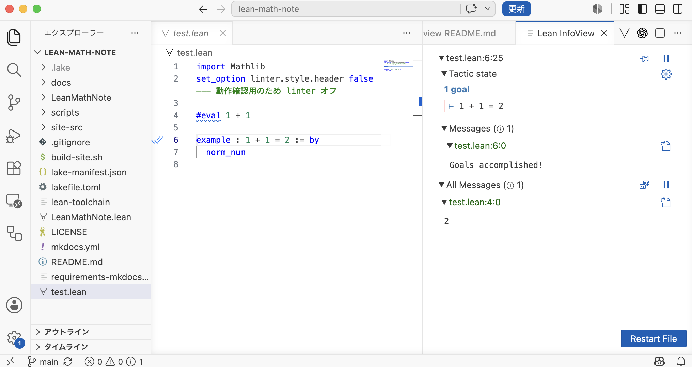
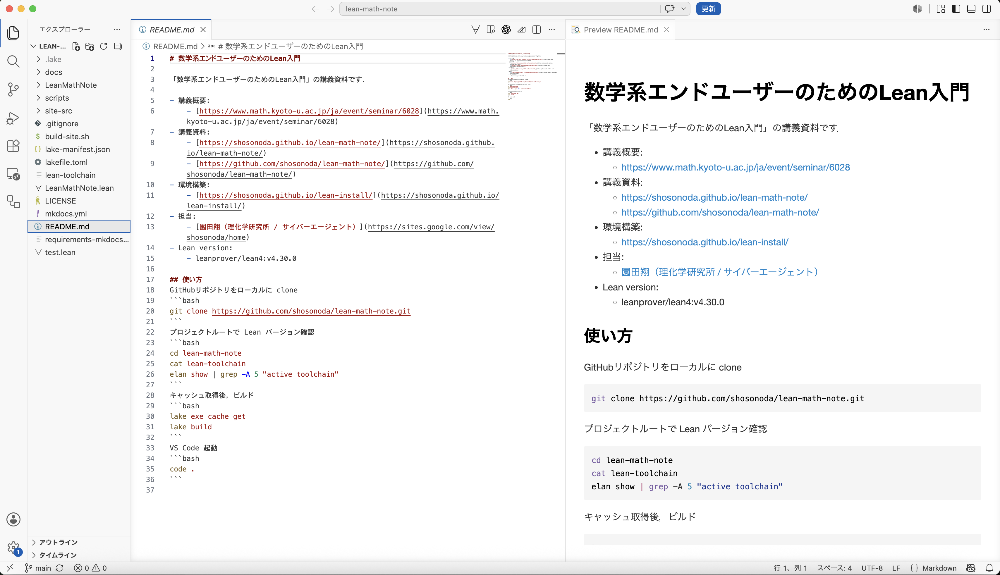

# 確認チェックリスト

ローカルに環境が準備できていることを確認するためのリストです．
まず

- [公式のLeanインストール手順](https://lean-lang.org/install/)に沿って環境構築
- 講義資料の [GitHub リポジトリ](https://github.com/shosonoda/lean-math-note/) を clone

したあとに，以下のリストで足りないものを確認してください．

## 作業フォルダ

### A. 基本コマンド

ターミナルを新しく開いて確認します．

```bash
git --version
curl --version
code --version
elan --version
lean --version
lake --version
```

チェック:

-  [ ] `git --version` が表示される
-  [ ] `curl --version` が表示される
-  [ ] `code --version` が表示される
-  [ ] `elan --version` が表示される
-  [ ] `lean --version` が表示される
-  [ ] `lake --version` が表示される

動かない場合:

- `git` / `curl` は [作業マニュアル 2](setup-manual.md#2-git-curl) と [リカバリー 0](recovery.md#0-git-curl-code)
- `code` は [作業マニュアル 1](setup-manual.md#1-vs-code) と [リカバリー 0](recovery.md#0-git-curl-code)
- `elan` / `lean` / `lake` は [作業マニュアル 4](setup-manual.md#4-elan-lean) と [リカバリー 3](recovery.md#3-elan-lean-lake)

!!! warning "`lake` がないと言われる場合"
    OS のパッケージマネージャで別の `lake` や `elan` を入れようとしないでください．Lean 公式の `elan` が PATH に入っているかを確認します．

### B. GitHub CLI

GitHub CLI を使う場合だけ確認します．

```bash
gh --version
gh auth status
gh config get git_protocol
```

チェック:

- [ ] `gh --version` が表示される
- [ ] `gh auth status` でログイン済みと表示される
- [ ] `gh config get git_protocol` が `https` になっている

動かない場合:

- GitHub CLI を使う場合は [作業マニュアル 5](setup-manual.md#5-github-cli)，[リカバリー 1](recovery.md#1-gh)，[リカバリー 2](recovery.md#2-github-ssh)
- GitHub アカウントを持っていない場合や急ぐ場合は，GitHub CLI を使わず [作業マニュアル 6](setup-manual.md#6-clone) の HTTPS clone に進んでください

### C. 講義用リポジトリ

以下では例として作業フォルダを `LeanProjects` とする．

確認コマンド:

Windows PowerShell:

```powershell
cd C:\LeanProjects\lean-math-note
Get-ChildItem
Get-Content lean-toolchain
```

macOS / Linux:

```bash
cd ~/LeanProjects/lean-math-note
ls
cat lean-toolchain
```

チェック:

- [ ] 作業フォルダが存在する
- [ ] `lean-toolchain` がある
- [ ] `lakefile.toml` または `lakefile.lean` がある
- [ ] `lake-manifest.json` がある

動かない場合:

- 作業フォルダは [作業マニュアル 0](setup-manual.md#0)
- clone は [作業マニュアル 6](setup-manual.md#6-clone)
- フォルダを間違えている場合は [リカバリー 4.1](recovery.md#41)
- フォルダを作り直す場合は [リカバリー 9](recovery.md#9)

---
## Lean

### D. プロジェクトの Lean バージョン

プロジェクトルートで実行します

```bash
elan show
lean --version
lake --version
```

成功時メッセージ例
```bash
# 成功時メッセージ例（elan）
# active toolchain
# ----------------
# leanprover/lean4:v4.30.0 (overridden by '/Users/shosonoda/work/temp/temp-math-mdgen/lean-toolchain')
# Lean (version 4.30.0, arm64-apple-darwin24.6.0, commit d024af099ca4bf2c86f649261ebf59565dc8c622, Release)
#
# 成功時メッセージ例（lean）
# Lean (version 4.30.0, arm64-apple-darwin24.6.0, commit d024af099ca4bf2c86f649261ebf59565dc8c622, Release)
#
# 成功時メッセージ例（lake）
# Lake version 5.0.0-src+d024af0 (Lean version 4.30.0)
```

チェック:

- [ ] `elan show` の active toolchain が，このフォルダの `lean-toolchain` に対応している
- [ ] `lean --version` が表示される
- [ ] `lake --version` が表示される

動かない場合:

- `elan` の導入は [作業マニュアル 4](setup-manual.md#4-elan-lean)
- リポジトリ側の確認は [作業マニュアル 6](setup-manual.md#6-clone)
- バージョン違いや toolchain の破損が疑われる場合は [リカバリー 6](recovery.md#6-lean-mathlib)

### E. Mathlib キャッシュ取得

```bash
lake exe cache get
```

成功時メッセージ例（数値は変動する）
```bash
# Completed successfully in 44928 ms!
```

チェック:

- [ ] エラーで止まらない
- [ ] `.lake` フォルダができている
- [ ] 途中でネットワークエラー，認証エラー，SSH エラーが出ない
- [ ] `Completed successfully` という成功メッセージが出る


動かない場合:

- 通常手順は [作業マニュアル 7](setup-manual.md#7-mathlib)
- 失敗した場合は [リカバリー 4](recovery.md#4-lake-exe-cache-get)
- SSH エラーなら [リカバリー 2](recovery.md#2-github-ssh)

### F. ビルド

```bash
lake build
```
成功時メッセージ（数値は変動する）
```bash
# Build completed successfully (8479 jobs).
```

チェック:

- [ ] `lake build` がエラーなく終了する
- [ ] `Build completed successfully` という成功メッセージが出る
- [ ] Mathlib 全体を何時間もビルドし始めていない

動かない場合:

- 通常手順は [作業マニュアル 8](setup-manual.md#8)
- 長時間ビルドになった場合は [リカバリー 5](recovery.md#5-lake-build-mathlib)
- バージョン違いが疑われる場合は [リカバリー 6](recovery.md#6-lean-mathlib)
- ローカル復旧が間に合わない場合は [Codespaces 利用手順](codespaces.md)

!!! tip "長時間ビルドになったら"
    `lake exe cache get` が失敗している，またはキャッシュが正しく展開されていない可能性があります．無理に数時間待つ前に，リカバリー手順の「キャッシュを取り直す」を試します．

---

## VS Code

### G. VS Code

プロジェクトルート（`~/LeanProjects/lean-math-note/` 直下）で:

```bash
code .
```

**実行例:** VS Code + Lean InfoView で `test.lean` を開いた例



チェック:

- [ ] VS Code が起動して `lean-math-note` フォルダを直接開いている．親フォルダ（`LeanProjects`）ではない．
- [ ] Lean 4 拡張機能が有効（操作コマンドに ∀ ボタンが出る）
- [ ] 適当な `.lean` ファイルを開くと右側に Lean Infoview が出る
- [ ] `import Mathlib` がエラーにならない
- [ ] `#eval 1 + 1` の結果が見える

動かない場合:

- 拡張機能は [作業マニュアル 3](setup-manual.md#3-vs-code-lean-4)
- 開くフォルダは [作業マニュアル 9](setup-manual.md#9-vs-code)
- Lean の確認は [作業マニュアル 10](setup-manual.md#10-lean-vs-code)
- VS Code 側だけ動かない場合は [リカバリー 7](recovery.md#7-vs-code-lean)

### H. Markdown プレビュー

この機能は必須ではありませんが， .md ファイルを編集する際に便利です．

チェック:

- [ ] `README.md` を開ける
- [ ] Windows/Linux で `Ctrl+Shift+V`，macOS で `Cmd+Shift+V` によりプレビューが表示される
- [ ] `Markdown: Open Preview to the Side` が使える

動かない場合:

- 通常手順は [作業マニュアル 11](setup-manual.md#11-markdown) 
- プレビューが開かない場合は [リカバリー 8](recovery.md#8-markdown)

**実行例:** VS Code + Markdown Preview で `README.md` を開いた例




<!-- ---
## 事務連絡

### I. トラブル時に講師へ送る情報

問題が起きたら，次の情報を送ってください

- OS: Windows / macOS / Linux の種別とバージョン
- 使っているターミナル: PowerShell / Command Prompt / Git Bash / Terminal など
- 作業フォルダのパス
- 実行したコマンド
- エラーメッセージ全文
- 次のコマンドの結果

```bash
git --version
curl --version
elan --version
lean --version
lake --version
elan show
```

可能なら `lake exe cache get` と `lake build` のエラー部分のスクリーンショットも添付してください

!!! failure "講義中に復旧が間に合わない場合"
    まず [リカバリー手順書](recovery.md) を確認してください．ローカル環境の復旧に時間がかかる場合は，[Codespaces 利用手順](codespaces.md) でブラウザ上の Lean 環境に切り替えられます． -->
